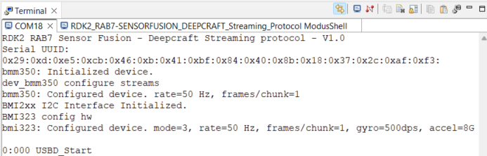

# DEEPCRAFT&trade; streaming protocol v2 for RDK2 and RAB7-SENSORFUSION

This project implements the DEEPCRAFT&trade; streaming protocol v2, allowing the streaming of sensor data and other information from the board into DEEPCRAFT&trade; Studio for development and testing of Edge AI models.

Currently supported sensors are:
- BMM350 (magnetometer)
- BMI323 (3 axis accelerometer, 3 axis gyroscope)

## Operation

1. Mount the RAB7-SENSORFUSION adapter on RDK2 Arduino connectors P1, P5, P3, P4.


2. Connect the board to your PC using the provided USB cable through the KitProg3 USB connector.


3. Program the board.


In the terminal output you should see:



4. Connect the board to your PC using the USB-C connector.


5. Open DEEPCRAFT&trade;. The sensors should be available inside the node explorer:


6. Create a new Graph UX project, and add the sensors into the graph:


7. Click on the start button start recording the data:


## Requirements

- [ModusToolbox® software](https://www.infineon.com/cms/en/design-support/tools/sdk/modustoolbox-software/) **v2025.4.0** [built with **v3.3**]
- [RAB7-SENSORFUSION Arduino Adapter Board](https://www.rutronik24.fr/produit/rutronik/rab7sensorfusion/24886398.html)
- [RDK2](https://www.rutronik24.fr/produit/rutronik/rdk2/16440182.html)

## Supported toolchains (make variable 'TOOLCHAIN')

- GNU Arm&reg; Embedded Compiler v11.3.1 (`GCC_ARM`) - Default value of `TOOLCHAIN`

## Using the code example

Create the project and open it using one of the following:

<details><summary><b>In Eclipse IDE for ModusToolbox&trade; software</b></summary>


1. Click the **New Application** link in the **Quick Panel** (or, use **File** > **New** > **ModusToolbox&trade; Application**). This launches the [Project Creator](https://www.infineon.com/ModusToolboxProjectCreator) tool.

2. Pick a kit supported by the code example from the list shown in the **Project Creator - Choose Board Support Package (BSP)** dialog.

   When you select a supported kit, the example is reconfigured automatically to work with the kit. To work with a different supported kit later, use the [Library Manager](https://www.infineon.com/ModusToolboxLibraryManager) to choose the BSP for the supported kit. You can use the Library Manager to select or update the BSP and firmware libraries used in this application. To access the Library Manager, click the link from the **Quick Panel**.

   You can also just start the application creation process again and select a different kit.

   If you want to use the application for a kit not listed here, you may need to update the source files. If the kit does not have the required resources, the application may not work.

3. In the **Project Creator - Select Application** dialog, choose the example by enabling the checkbox.

4. (Optional) Change the suggested **New Application Name**.

5. The **Application(s) Root Path** defaults to the Eclipse workspace which is usually the desired location for the application. If you want to store the application in a different location, you can change the *Application(s) Root Path* value. Applications that share libraries should be in the same root path.

6. Click **Create** to complete the application creation process.

For more details, see the [Eclipse IDE for ModusToolbox&trade; software user guide](https://www.infineon.com/MTBEclipseIDEUserGuide) (locally available at *{ModusToolbox&trade; software install directory}/docs_{version}/mt_ide_user_guide.pdf*).

</details>

<details><summary><b>In command-line interface (CLI)</b></summary>


ModusToolbox&trade; software provides the Project Creator as both a GUI tool and the command line tool, "project-creator-cli". The CLI tool can be used to create applications from a CLI terminal or from within batch files or shell scripts. This tool is available in the *{ModusToolbox&trade; software install directory}/tools_{version}/project-creator/* directory.

Use a CLI terminal to invoke the "project-creator-cli" tool. On Windows, use the command line "modus-shell" program provided in the ModusToolbox&trade; software installation instead of a standard Windows command-line application. This shell provides access to all ModusToolbox&trade; software tools. You can access it by typing `modus-shell` in the search box in the Windows menu. In Linux and macOS, you can use any terminal application.

The "project-creator-cli" tool has the following arguments:

| Argument          | Description                                                  | Required/optional |
| ----------------- | ------------------------------------------------------------ | ----------------- |
| `--board-id`      | Defined in the `<id>` field of the [BSP](https://github.com/Infineon?q=bsp-manifest&type=&language=&sort=) manifest | Required          |
| `--app-id`        | Defined in the `<id>` field of the [CE](https://github.com/Infineon?q=ce-manifest&type=&language=&sort=) manifest | Required          |
| `--target-dir`    | Specify the directory in which the application is to be created if you prefer not to use the default current working directory | Optional          |
| `--user-app-name` | Specify the name of the application if you prefer to have a name other than the example's default name | Optional          |

<br />

The following example clones the "[Hello world](https://github.com/Infineon/mtb-example-hal-hello-world)" application with the desired name "MyHelloWorld" configured for the *CY8CPROTO-062-4343W* BSP into the specified working directory, *C:/mtb_projects*:

   ```
   project-creator-cli --board-id CY8CPROTO-062-4343W --app-id mtb-example-hal-hello-world --user-app-name MyHelloWorld --target-dir "C:/mtb_projects"
   ```

**Note:** The project-creator-cli tool uses the `git clone` and `make getlibs` commands to fetch the repository and import the required libraries. For details, see the "Project creator tools" section of the [ModusToolbox&trade; software user guide](https://www.infineon.com/ModusToolboxUserGuide) (locally available at *{ModusToolbox&trade; software install directory}/docs_{version}/mtb_user_guide.pdf*).

To work with a different supported kit later, use the [Library Manager](https://www.infineon.com/ModusToolboxLibraryManager) to choose the BSP for the supported kit. You can invoke the Library Manager GUI tool from the terminal using `make modlibs` command or use the Library Manager CLI tool "library-manager-cli" to change the BSP.

The "library-manager-cli" tool has the following arguments:

| Argument             | Description                                                  | Required/optional |
| -------------------- | ------------------------------------------------------------ | ----------------- |
| `--add-bsp-name`     | Name of the BSP that should be added to the application      | Required          |
| `--set-active-bsp`   | Name of the BSP that should be as active BSP for the application | Required          |
| `--add-bsp-version`  | Specify the version of the BSP that should be added to the application if you do not wish to use the latest from manifest | Optional          |
| `--add-bsp-location` | Specify the location of the BSP (local/shared) if you prefer to add the BSP in a shared path | Optional          |

<br />

Following example adds the CY8CPROTO-062-4343W BSP to the already created application and makes it the active BSP for the app:

   ```
   library-manager-cli --project "C:/mtb_projects/MyHelloWorld" --add-bsp-name CY8CPROTO-062-4343W --add-bsp-version "latest-v4.X" --add-bsp-location "local"

   library-manager-cli --project "C:/mtb_projects/MyHelloWorld" --set-active-bsp APP_CY8CPROTO-062-4343W
   ```

</details>

## Legal Disclaimer

The evaluation board including the software is for testing purposes only and, because it has limited functions and limited resilience, is not suitable for permanent use under real conditions. If the evaluation board is nevertheless used under real conditions, this is done at one’s responsibility; any liability of Rutronik is insofar excluded. 


